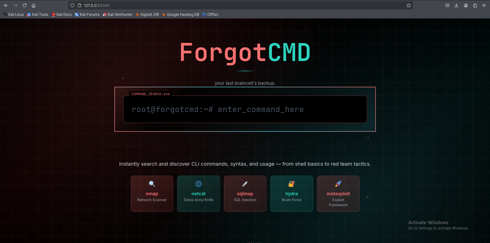

# ForgotCMD

**A web-based command cheat sheet for hackers, red teamers, sysadmins, and developers.**  
Never forget a CLI command again — from privilege escalation to Docker tricks, it's all here. 

---

## 🚀 Features

- 🔍 Fast, searchable command database
- 🧰 Covers Linux, Windows, AD, Docker, Git, and more
- 📱 Mobile-friendly design
- 🧑‍💻 Red team & hacker-oriented
- 🌐 Runs entirely in your browser (no backend)

---

## 🖼️ Preview



---

## 🛠️ Setup

### Install Hugo (if not already installed)

```bash
# macOS (Homebrew)
brew install hugo

# Ubuntu/Debian
sudo apt install hugo

# Windows (Scoop)
scoop install hugo
```

### Clone the Repository

```bash
git clone https://github.com/GopherGhaznix/ForgotCMD.git

cd ForgotCMD
```
### Start the Hugo Development Server

```bash
hugo server --disableFastRender
```

Then open your browser and go to: [http://localhost:1313](http://localhost:1313)

---

## ✍️ Contributing

Feel free to open issues or submit PRs to add new command categories or improve UI/UX.

---

## 📜 License

MIT License.
Developed by [MikiVirus](https://mikivirus.me)

